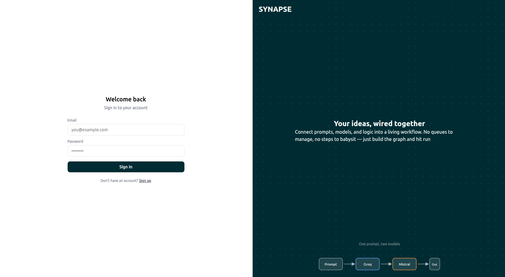
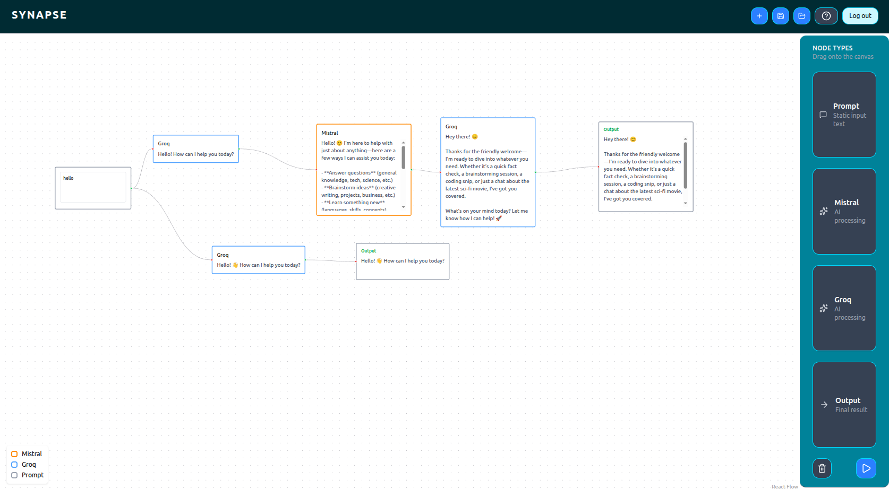

# AI Workflow Automator

[](https://github.com/MFahadAfzal/AI-Workflow-Automater/actions)

**Deployed URL:** https://ai-workflow-automater-1.onrender.com/

Please wait 30-60 seconds after first clicking sign in — hosted on Render's free tier, which spins the server down when idle and takes a moment to spin back up on the first request.

**Demo account:**
Email: `guest@guest.com`
Password: `guest`

A visual, drag-and-drop workflow builder for chaining and executing AI-powered tasks. Design workflows as a graph of connected nodes, then run them with real-time streaming output, safe concurrent execution, and automatic dependency resolution.





## Features

- **Visual canvas** — Build workflows by dragging and connecting nodes on a [React Flow](https://reactflow.dev/) canvas.
- **DAG execution engine** — Workflows are modeled as directed acyclic graphs. Execution order is resolved with Kahn's algorithm (topological sort), with automatic cycle detection to catch invalid workflows before they run.
- **Parallel execution** — Independent branches of a workflow execute concurrently rather than strictly sequentially.
- **Live streaming output** — Node outputs stream in real time over WebSockets, powered by Groq and Mistral APIs.
- **Per-user connection tracking** — WebSocket connections are tracked per user, with race-condition-safe state management for concurrent sessions.
- **Node status events** — Each node emits `started`, `complete`, and `aborted` events so the UI reflects live execution state.
- **Authentication** — JWT-based auth with middleware-enforced route protection.
- **Persistence** — Workflow state is persisted client-side via `localStorage`.

## Testing & CI

The core DAG execution engine has unit test coverage for:

- Basic data flow between nodes
- AI-node integration (mocked, no live API calls in tests)
- Multiple dependencies converging on a single node
- Cycle detection, including correct WebSocket abort messaging
- Parallel/independent branch execution in isolation
- Empty-input edge case
- Node-type routing (AI calls only fire for AI node types)

Tests run automatically on every push and pull request via GitHub Actions — see the badge above, or the [workflow file](./.github/workflows/main.yml).

To run tests locally:

```bash
cd server
npm test
```

## Tech Stack

- **Frontend:** React, React Flow
- **Backend:** Node.js, Express
- **Real-time:** WebSockets
- **Auth:** JWT
- **AI Providers:** Groq, Mistral (streaming completions)
- **Database:** Supabase
- **Testing:** Jest
- **CI/CD:** GitHub Actions
- **Deployment:** Render

## Getting Started

### Prerequisites

- Node.js (v18+ recommended)
- npm or yarn
- A PostgreSQL database (Supabase recommended)
- API keys for Groq and Mistral

### Installation

1. Clone the repository:
   ```bash
   git clone https://github.com/MFahadAfzal/AI-Workflow-Automater.git
   cd AI-Workflow-Automater
   ```

2. Install dependencies for both client and server:
   ```bash
   cd client
   npm install
   cd ../server
   npm install
   ```

3. Create a `.env` file in the `server` directory with the following variables:
   ```env
   PORT=3000
   DATABASE_URL=your_database_url
   JWT_SECRET=your_jwt_secret
   GROQ_API_KEY=your_groq_api_key
   MISTRAL_API_KEY=your_mistral_api_key
   ```

4. Run the backend server:
   ```bash
   cd server
   npm start
   ```

5. Run the frontend (in a separate terminal):
   ```bash
   cd client
   npm run dev
   ```

6. Open [http://localhost:5173](http://localhost:5173) in your browser.

## How It Works

1. Build a workflow by dragging nodes onto the canvas and connecting them.
2. On execution, the engine topologically sorts the node graph using Kahn's algorithm, validating that no cycles exist.
3. Independent nodes execute in parallel; dependent nodes wait for their upstream nodes to complete.
4. Each node's output streams back over a WebSocket connection scoped to the current user's session.
5. Node status updates (`started`, `complete`, `aborted`) update the canvas in real time.